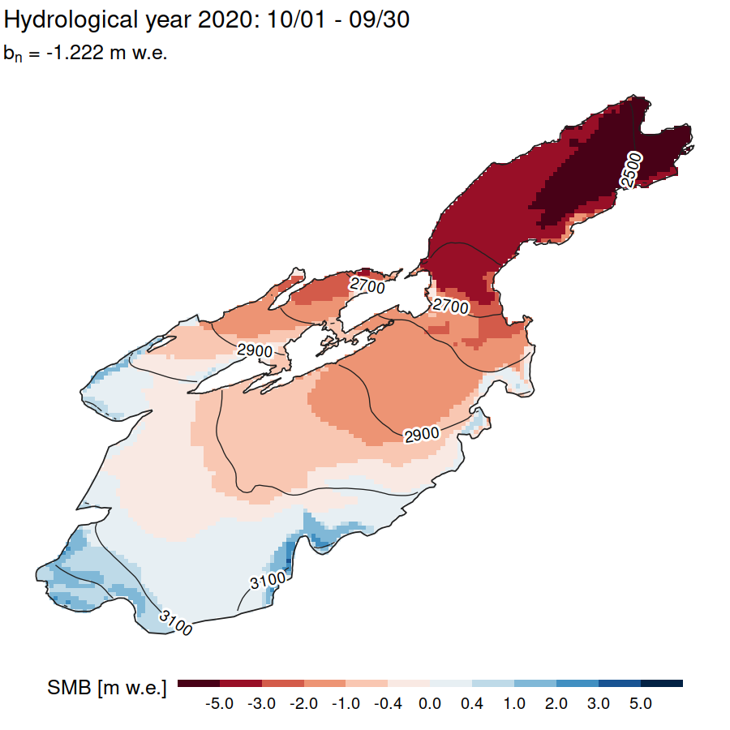

# Contents

1. [Introduction](#intro)

2. [Quick start](#quickstart)

    2.1. [Minimal installation instructions](#installation)

    2.2. [Minimal usage instructions](#usage)

3. [Additional features](#features)

4. [Known limitations](#limitations)

5. [Published works with DMBSim applications](#publications)

6. [Acknowledgments](#acknowledgments)

7. [References](#references)

 

# Introduction

DMBSim 3.0 is a tool to calculate and homogenize glacier surface mass balance from point measurements. It works by running a gridded model of daily accumulation and melt, based on topographical and meteorological data. The main parameters are optimized to match the average mass balance of the provided point measurements [[1]](#ref1). DMBSim is suitable for research, teaching, and operational mass balance monitoring. It is currently used to support the glaciological programs of countries in Central Asia: Kazakhstan, Kyrgyzstan, Tajikistan, and Uzbekistan.

**Main features:**

* Calculation of annual glacier-wide mass balance homogenized to regular intervals (such as the hydrological year)

* Leave-one-out validation with point measurements

* Calculations over multiple years (conventional or reference-surface mass balance, cumulative change)

* Processing of multiple glaciers and full catchments

* Simulation of past conditions, future scenarios, years with no measurements

* High-quality output visualizations

DMBSim is implemented in R (with some C++ routines for performance), is fully cross-platform (Windows / Mac OS / Linux), and is designed to be run within RStudio. Several graphical tools are provided to easily prepare the input data in a consistent format.

 

# Quick start

[Tutorial 1](/doc/tutorial1_singleyear/DMBSim_tutorial_1.pdf) will guide you through system setup and simple mass balance calculations. Alternatively, follow the steps below.

## Minimal installation instructions

1. Setup R via [the official installer](https://cran.r-project.org/) or from your package manager. It is recommended to use the latest version: DMBSim was developed using R version 4.2.x and newer, but the full functionality is currently maintained for version 4.5.x.

2. Setup RStudio via [the official installer](https://docs.posit.co/ide/user/#rstudio-ide-oss-downloads) or from your package manager.

3. If on Windows, setup RTools via [the official installer](https://cran.r-project.org/bin/windows/Rtools/).

4. Download and extract [the DMBSim repository](https://github.com/MatteaE/mass_balance_model/archive/refs/heads/main.zip).

5. Install the required R packages: within RStudio, open file `utils/install_packages.R` and run it by clicking on the <em>Source</em> button.

Everything is ready!

## Minimal usage instructions

1. Procure a Digital Elevation Model (DEM) of your area of interest, for example from [OpenTopography](https://portal.opentopography.org/dataCatalog). The DEM should have no gaps (missing data) over that area. The reference system (CRS) does not matter as long as it is defined (for example, in the GeoTiff format).

2. Procure an outline of your glacier of interest, for example from [the Randolph Glacier Inventory](https://www.glims.org/RGI/). You can also draw one yourself with a GIS program.

3. Open file `utils/make_input.R` within RStudio, run it by clicking on the <em>Run App</em> button, and follow the instructions there.

4. Place the folder created by `make_input.R` (with the glacier name) inside the `input` folder.

5. Prepare the text file with the meteorological time series and place it in folder `weather` inside the `input` folder. The tools under `utils/aggregate_meteo_data.R` and `utils/meteo_concatenate.R` can help preparing the data in the correct file format.

6. Prepare the text file with the mass balance measurements and place it in folder `massbalance` inside the `input` folder. See [the example from Tutorial 1](doc/tutorial1_singleyear/tutorial_1_input/yakarcha/massbalance) for the correct file format.

7. In RStudio, open file `set_params.R` and configure the model with the appropriate parameters - at least:
    * Glacier name
    
    * Input file names
    
    * Reference altitude of the meteorological series
    
    * Selection of years to be modeled

8. In RStudio, open file `main.R` and launch the calculations by clicking on the <em>Source</em> button.

For more advanced usage, check out [Tutorial 1](/doc/tutorial1_singleyear/DMBSim_tutorial_1.pdf) and [Tutorial 2](/doc/tutorial2_multiyear/DMBSim_tutorial_2.pdf).

 

# Additional features

* **Simple usage, suitable as a teaching tool:**

    * In-depth [documentation](/doc)
    
    * Common file formats such as GeoTiff, Shapefile, GeoPackage, CSV
    
    * Graphical tools to easily prepare the input data from different sources
    
    * Full support for locations in both the Northern and Southern Hemisphere, with specific definitions of seasonal boundaries and automatic handling of geographic projections

    * Comprehensive handling of exceptions, errors, and unexpected inputs
    
    * Detailed logging in RStudio console, log files, and modal dialogs
    
* **High performance:**

    * A typical run takes just a few seconds per simulated year on a consumer laptop
    
    * High-resolution simulations with > 105 grid cells can fit within ~10 GB of RAM
    
    * Memory release is optimized - centennial-scale simulations are possible with no additional RAM penalty
    
    * Advanced leave-one-out validation minimizes the number of model runs

* **Accumulation routines:**

    * Spatial snow distribution based on topographic parameters, winter measurements, user-supplied files, previous model runs, or a combination of them
    
    * Snow redistribution using a process-based avalanche model [[2]](#ref2)
    
* **Ablation routines:**

    * Melt calculation based on an Enhanced Temperature Index model (air temperature and potential solar radiation) [[3]](#ref3)
    
    * Individual melt factors for snow, firn, clean ice, and debris-covered ice
    
    * Optional spatially variable albedo
    
* **Calibration to reference mass balance:**

    * Support for multiple measurements throughout the year
    
    * Optional clustering of measurements to improve spatial representativity

    * Support for accumulation measurements with no reference surface (unknown starting date)
    
* **Output:**

    * Publication-ready vector plots (maps, time series, profile distributions)
    
    * GeoTiff maps and CSV files with all calculated results
    
* **For developers:**

    * Modular (100+ function files), well-commented, cross-platform codebase
    
    * Custom multi-level logging engine
    
    * Designed to work with a standard modern installation of R
        
* **Minimal input data:**

    * One or more Digital Elevation Models (DEMs) covering the area of interest
    
    * One or more vector outlines of the glacier(s) of interest
    
    * A set of gridded files of potential solar radiation covering the area of interest. A tool is provided to calculate these from the DEMs
    
    * A daily time series of air temperature and total precipitation. A tool is provided to assemble the series from AWS measurements
    
    * A set of point measurements of mass balance. There is no constraint on the spatio-temporal distribution of those measurements. The tool will run (uncalibrated) even if the measurements are missing
    
* **Optional extra input data:**

    * One or more vector outlines of debris-covered regions
    
    * One or more maps of snow distribution to be used in the calculations
    
    * One or more files of year-specific parameters
    
    * A set of points where daily mass balance should be written to CSV files

    
 

# Known limitations

* The physical routines only simulate surface mass balance - subsurface processes are ignored

* Measured points are considered spatially fixed during their observation period - intra-annual displacement due to ice flow is ignored

* The simulation is performed year by year - point measurements collected at intervals of two or more years are not supported for model calibration

* The melt model is a simple Enhanced Temperature Index formula based on daily mean air temperature - potentially unsuitable at very high altitude sites with a radiation-dominated melting regime

* Melt of a debris-covered ice surface is rather simplified, with a uniform reduction factor

* Only a limited number of geographic projections are supported: Universal Transverse Mercator (UTM) is strongly preferred, other projected coordinate systems might also work

 

# Published works with DMBSim applications

1. Azisov E., Barandun M., Saks T., Mattea E., Hoelzle M., Kim D., Bakirov K., Usubaliev R., and Kenzhebaev R. (2025). Reconstruction of the mass balance and dynamics of glaciers in the Orto-Koy-Suu basin (Northern Tien Shan). International Mountain Conference 2025, Innsbruck, Austria.

2. Belekov S., Hyvarinen A., Barandun M., Mattea E., Akmatov R., Warley J., Manninen H., Svensson J., and Kenzhebaev R. (2025). Dynamics of Mass Balance and Area Change of the Turgen-Aksuu Glacier (1970-2024). International Mountain Conference 2025, Innsbruck, Austria

3. Kabutov K., Amirzoda O. H., Sheralizoda N. S., Mattea E., Saks T., and Abdulloeva P. N. (2024). Modeling the mass balance of glacier №139 of the Eastern Pamir lake Karakul basin using the SMB model. Water Resources, Energy and Ecology, 4, 41–53.

4. Kenzhebaev R., Barandun M., Mattea E., Usubaliev R., Azisov E., Saks T., Mandychev A., and Hoelzle M. (2022). Mass balance and area change of glacier No. 354 and Batysh Sook (№419) of the Inner Tien Shan, Kyrgyzstan. Conference «Cryosphere and related hazards in High Mountain Asia in a changing climate», Almaty, Kazakhstan.

5. Kenzhebaev R., Barandun M., Mattea E., Azisov E., Esenaman Uulu M., Satarov S., Pohl E., Saks T., Hoelzle M., and Usubaliev R. (2025). Changes in glacier area and the glacial component of runoff in the upper reaches of the Naryn River. International Mountain Conference 2025, Innsbruck, Austria.

6. Kmetyko S. (2026). Quantifying Ice Loss and Related Processes of Vanishing Glaciers – Goldbergkees and Kleinfleißkees, Austrian Alps. Master’s thesis, University of Graz.

7. Navruzshoev H., Kayumov A., Kabutov K., Saks T., Barandun M., Mattea E., Smirnov A., and Hoelzle M. (2023). Basic research on glacier No. 457 of the Gunt river basin. Conference «Impact of climate change on the state of glaciers of the Republic of Tajikistan and protection of glaciers», Dushanbe, Tajikistan.

8. Navruzshoev H., Kayumov A., Saks T., Barandun M., Kabutov K., Mattea E., Smirnov A., and Hoelzle M. (2023). Glacier mass balance in the Gunt river basin, Pamir, Tajikistan. 21st Swiss Geoscience Meeting, Mendrisio, Switzerland.

9. Navruzshoev H., Saks T., Sheralizoda N., Kabutov K., Barandun M., Mattea E., and Hoelzle M. (2025). Glacier mass balance in the Gunt river basin, Pamir, Tajikistan. International Mountain Conference 2025, Innsbruck, Austria.

10. Severskiy I., Kapitsa V., Kassatkin N., Usmanova Z., Saks T., Mattea E., and Kissebayev D. (2025). Comparison of the modelled and measured mass balance of the Central Tuyuksu glacier, northern slope of Ili-Alatau, Journal of Geography and Environmental Management, 75, 4, 16–31, doi: 10.26577/JGEM.2024.v75.i4.2.

11. Umirzakov G., Kholtojiyeva O., Eshmuratov D., Gulmurzayeva B., Mattea E., and Barandun M. (2025). Mass balance modeling of the Barkrak glacier. (pp. 130–135). International Scientific and Practical Conference «Innovative methods for monitoring mountain glaciers under climate change and current challenges in glaciology». Tashkent, Uzbekistan.

 

# Acknowledgments
Special thanks to the following people for their precious assistance with testing and improving the program: Erlan Azisov, Martina Barandun, Sultanbek Belekov, Ardamehr Halimov, Khusrav Kabutov, Ruslan Kenzhebaev, Silvio Kmetyko, Hofiz Navruzshoev, Tomas Saks, Gulomjon Umirzakov.

DMBSim 3.0 uses the following R packages:

| Package | Version | Citation |
|---|---|---|
| base | 4.5.2 | R Core Team. 2025. [*R: A Language and Environment for Statistical Computing*](https://www.R-project.org/). R Foundation for Statistical Computing. |
| cowplot | 1.2.0 | Wilke, Claus O. 2025. [*cowplot: Streamlined Plot Theme and Plot Annotations for "ggplot2"*](https://doi.org/10.32614/CRAN.package.cowplot). |
| fs | 1.6.7 | Hester, Jim, Hadley Wickham, and Gábor Csárdi. 2026. [*fs: Cross-Platform File System Operations Based on "libuv"*](https://doi.org/10.32614/CRAN.package.fs). |
| ggpattern | 1.3.1 | FC M, Davis T, ggplot2 authors (2026). [*ggpattern: 'ggplot2' Pattern Geoms*](https://doi.org/10.32614/CRAN.package.ggpattern). |
| ggplot2 | 4.0.2 | H. Wickham. [*ggplot2: Elegant Graphics for Data Analysis*](https://ggplot2-book.org/). Springer-Verlag, New York, 2016. |
| ggpubr | 0.6.2 | Kassambara A (2025). [*ggpubr: 'ggplot2' Based Publication Ready Plots*](https://doi.org/10.32614/CRAN.package.ggpubr). |
| ggtext | 0.1.2 | Wilke C, Wiernik B (2022). [*ggtext: Improved Text Rendering Support for 'ggplot2'*](https://doi.org/10.32614/CRAN.package.ggtext). |
| grid | 4.5.2 | R Core Team. 2025. [*R: A Language and Environment for Statistical Computing*](https://www.R-project.org/). R Foundation for Statistical Computing. |
| gstat | 2.1-3 | Pebesma, E.J., 2004. [*Multivariable geostatistics in S: the gstat package*](https://doi.org/10.1016/j.cageo.2004.03.012). Computers & Geosciences, 30: 683-691. Benedikt Gräler, Edzer Pebesma and Gerard Heuvelink, 2016. [*Spatio-Temporal Interpolation using gstat*](https://journal.r-project.org/articles/RJ-2016-014/). The R Journal 8(1), 204-218. |
| insol2 | 1.0.0 | Corripio, Javier G., and Enrico Mattea. 2023. [*Insol2: Solar Radiation*](https://github.com/MatteaE/insol2). Corripio, Javier G. 2020. [*Insol: Solar Radiation*](https://www.meteoexploration.com/R/insol/). |
| lwgeom | 0.2.15 | Pebesma, Edzer. 2026. [*lwgeom: Bindings to Selected "liblwgeom" Functions for Simple Features*](https://doi.org/10.32614/CRAN.package.lwgeom). |
| metR | 0.18.3 | Campitelli, Elio. 2025. [*metR: Tools for Easier Analysis of Meteorological Fields*](https://doi.org/10.32614/CRAN.package.metR). |
| notifier | 1.0.0 | Csárdi G (2017). [*notifier: Cross Platform Desktop Notifications*](https://cran.r-project.org/package=notifier). |
| qpdf | 1.3.4 | Ooms J (2024). [*qpdf: Split, Combine and Compress PDF Files*](https://doi.org/10.32614/CRAN.package.qpdf). |
| RColorBrewer | 1.1.3 | Neuwirth, Erich. 2022. [*RColorBrewer: ColorBrewer Palettes*](https://doi.org/10.32614/CRAN.package.RColorBrewer). |
| Rcpp | 1.1.1-1.1 | Eddelbuettel D, Francois R, Allaire J, Ushey K, Kou Q, Russell N, Ucar I, Bates D, Chambers J (2026). [*Rcpp: Seamless R and C++ Integration*](https://doi.org/10.32614/CRAN.package.Rcpp). Eddelbuettel D, François R (2011). [*Rcpp: Seamless R and C++ Integration*](https://doi.org/10.18637/jss.v040.i08). Journal of Statistical Software 40(8), 1-18. Eddelbuettel D (2013). [*Seamless R and C++ Integration with Rcpp*](https://doi.org/10.1007/978-1-4614-6868-4). Springer, New York, ISBN 978-1-4614-6867-7. Eddelbuettel D, Balamuta J (2018). [*Extending R with C++: A Brief Introduction to Rcpp.*](https://doi.org/10.1080/00031305.2017.1375990) The American Statistician 72(1), 28-36. |
| readxl | 1.4.5 | Wickham H, Bryan J (2025). [*readxl: Read Excel Files*](https://doi.org/10.32614/CRAN.package.readxl). |
| remotes | 2.5.0 | Csárdi, Gábor, Jim Hester, Hadley Wickham, Winston Chang, Martin Morgan, and Dan Tenenbaum. 2024. [*remotes: R Package Installation from Remote Repositories, Including "GitHub"*](https://doi.org/10.32614/CRAN.package.remotes). |
| reshape2 | 1.4.5 | Wickham H (2007). [*Reshaping Data with the reshape Package*](https://www.jstatsoft.org/v21/i12/) Journal of Statistical Software 21(12), 1-20. |
| Rfast | 2.1.5.2 | Manos Papadakis, Michail Tsagris, Marios Dimitriadis, et al. 2025. [*Rfast: A Collection of Efficient and Extremely Fast r Functions*](https://doi.org/10.32614/CRAN.package.Rfast). |
| scales | 1.4.0 | Wickham, Hadley, Thomas Lin Pedersen, and Dana Seidel. 2025. [*scales: Scale Functions for Visualization*](https://doi.org/10.32614/CRAN.package.scales). |
| sf | 1.0.24 | Pebesma, Edzer. 2018. [*Simple Features for R: Standardized Support for Spatial Vector Data.*](https://doi.org/10.32614/RJ-2018-009) The R Journal 10 (1): 439–46. Pebesma, Edzer, and Roger Bivand. 2023. [*Spatial Data Science: With applications in R*](https://doi.org/10.1201/9780429459016). Chapman and Hall/CRC. |
| shadowtext | 0.1.6 | Yu G (2025). [*shadowtext: Shadow Text Grob and Layer*](https://doi.org/10.32614/CRAN.package.shadowtext). |
| shiny | 1.10.0 | Chang W, Cheng J, Allaire J, Sievert C, Schloerke B, Xie Y, Allen J, McPherson J, Dipert A, Borges B (2024). [*shiny: Web Application Framework for R*](https://doi.org/10.32614/CRAN.package.shiny). |
| shinyFiles | 0.9.3 | Pedersen, Thomas Lin, Vincent Nijs, Thomas Schaffner, and Eric Nantz. 2022. [*shinyFiles: A Server-Side File System Viewer for Shiny*](https://doi.org/10.32614/CRAN.package.shinyFiles). |
| shinyjs | 2.1.0 | Attali, Dean. 2021. [*shinyjs: Easily Improve the User Experience of Your Shiny Apps in Seconds*](https://doi.org/10.32614/CRAN.package.shinyjs). |
| sp | 2.2-1 | Pebesma E, Bivand R (2005). [*Classes and methods for spatial data in R*](https://journal.r-project.org/articles/RN-2005-014/RN-2005-014.pdf). R News, 5(2), 9-13. Bivand R, Pebesma E, Gomez-Rubio V (2013). [*Applied spatial data analysis with R*](https://asdar-book.org/), Second edition. Springer, NY. |
| spatialEco | 2.0-3 | Evans, Jeffrey S, and Murphy, Melanie A (2025). [*spatialEco: Spatial Analysis and Modelling Utilities*](https://doi.org/10.32614/CRAN.package.spatialEco). |
| stats | 4.5.2 | R Core Team. 2025. [*R: A Language and Environment for Statistical Computing*](https://www.R-project.org/). R Foundation for Statistical Computing. |
| stringr | 1.6.0 | Wickham H (2025). [*stringr: Simple, Consistent Wrappers for Common String Operations*](https://doi.org/10.32614/CRAN.package.stringr). |
| terra | 1.9.11 | Hijmans, Robert J., Andrew Brown, and Márcia Barbosa. 2026. [*terra: Spatial Data Analysis*](https://doi.org/10.32614/CRAN.package.terra). |
| tidyverse | 2.0.0 | Wickham, Hadley, Mara Averick, Jennifer Bryan, et al. 2019. [*Welcome to the tidyverse.*](https://doi.org/10.21105/joss.01686) Journal of Open Source Software 4 (43): 1686. |
| timeSeries | 4052.112 | Wuertz D, Setz T, Chalabi Y, Boshnakov GN (2025). [*timeSeries: Financial Time Series Objects (Rmetrics)*](https://doi.org/10.32614/CRAN.package.timeSeries). |
| tools | 4.5.2 | R Core Team. 2025. [*R: A Language and Environment for Statistical Computing*](https://www.R-project.org/). R Foundation for Statistical Computing. |
| topmodel | 0.7.5 | Buytaert, Wouter. 2022. [*topmodel: Implementation of the Hydrological Model TOPMODEL in r*](https://doi.org/10.32614/CRAN.package.topmodel). |

 

# References

1.  Huss M., Bauder A., and Funk M. (2009). Homogenization of long-term mass-balance time series. Annals of Glaciology 50(50):198-206. [doi:10.3189/172756409787769627](https://doi.org/10.3189/172756409787769627)

2.  Gruber S. (2007). A mass-conserving fast algorithm to parameterize gravitational transport and deposition using digital elevation models. Water Resources Research 43, W06412. [doi:10.1029/2006WR004868](https://doi.org/10.1029/2006WR004868)

3.  Hock, R. (2003). Temperature index melt modelling in mountain areas. Journal of Hydrology 282, 104–115. [doi:10.1016/S0022-1694(03)00257-9](https://doi.org/10.1016/S0022-1694\(03\)00257-9)
